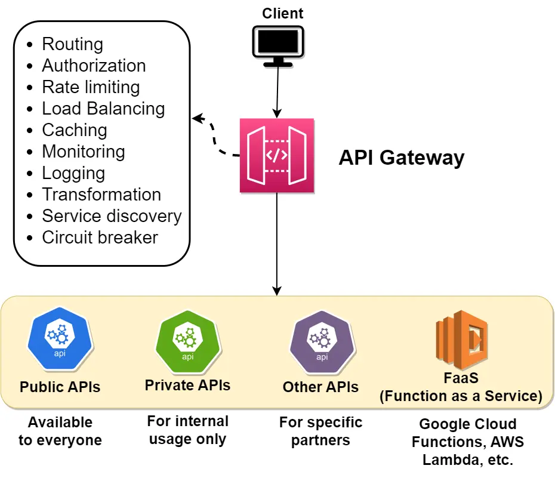
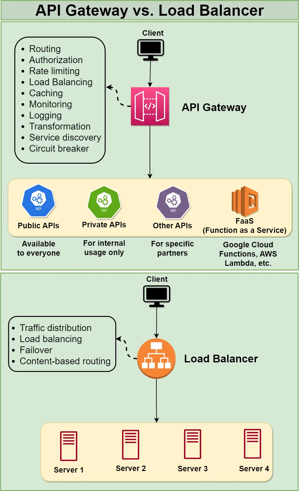

# Introduction to API Gateway

An **API Gateway** is a server-side architectural component in a software system that acts as an intermediary between clients (such as web browsers, mobile apps, or other services) and backend services, microservices, or APIs.

Its primary purpose is to provide a single entry point for external consumers to access the services and functionalities of the backend system. The API Gateway:

- Receives client requests.
- Forwards them to the appropriate microservice.
- Returns the server’s response to the client.

The API Gateway is responsible for tasks such as:

- **Routing**: Directing requests to the appropriate backend services.
- **Authentication**: Ensuring secure access to resources.
- **Rate Limiting**: Managing traffic flow to protect backend services.

This design allows microservices to focus on their individual tasks, enhancing the overall performance and scalability of the system.

---

## Difference Between an API Gateway and a Load Balancer

| **Feature**           | **API Gateway**                                      | **Load Balancer**                                        |
|------------------------|-----------------------------------------------------|---------------------------------------------------------|
| **Primary Purpose**    | Routes requests to the appropriate microservice.    | Distributes requests evenly across backend servers.     |
| **Request Type**       | Handles API-specific requests with unique URLs.     | Handles requests to a single IP, routing based on performance or availability. |
| **Focus**              | API-level functionalities like routing, rate limiting, and authentication. | Traffic distribution and server performance optimization. |

---

### Key Differences:

1. **Request Routing**:
   - **API Gateway**: Routes requests based on specific URLs identifying APIs. It forwards requests to the correct microservice.
   - **Load Balancer**: Routes requests sent to a single IP address to one of many backend servers.

2. **Use Case**:
   - **API Gateway**: Primarily handles API-specific tasks and functionalities.
   - **Load Balancer**: Focuses on distributing requests evenly to prevent server overload.

---

By combining an API Gateway with a load balancer, you can achieve both efficient request routing and optimized resource utilization, ensuring a robust and scalable system.
