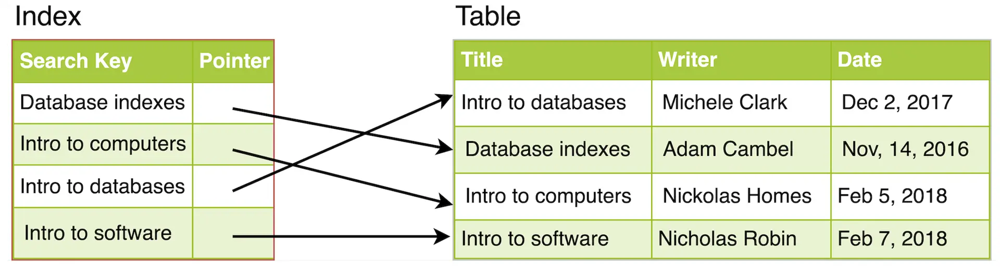

# What are Indexes?

Indexes are well known when it comes to databases. Sooner or later, there comes a time when database performance is no longer satisfactory. One of the very first things you should turn to when that happens is database indexing.

The goal of creating an index on a particular table in a database is to make it faster to search through the table and find the row or rows that we want. Indexes can be created using one or more columns of a database table, providing the basis for both rapid random lookups and efficient access of ordered records.

---

## Example: A Library Catalog

A library catalog is a register that contains the list of books found in a library. The catalog is organized like a database table generally with four columns: book title, writer, subject, and date of publication. There are usually two such catalogs: one sorted by the book title and one sorted by the writer name. That way, you can either think of a writer you want to read and then look through their books, or look up a specific book title you know you want to read in case you don’t know the writer’s name. These catalogs are like indexes for the database of books. They provide a sorted list of data that is easily searchable by relevant information.

Simply saying, an index is a data structure that can be perceived as a table of contents that points us to the location where actual data lives. So when we create an index on a column of a table, we store that column and a pointer to the whole row in the index. Let's assume a table containing a list of books, the following diagram shows how an index on the 'Title' column looks like:

Database Index

Just like a traditional relational data store, we can also apply this concept to larger datasets. The trick with indexes is that we must carefully consider how users will access the data. In the case of data sets that are many terabytes in size, but have very small payloads (e.g., 1 KB), indexes are a necessity for optimizing data access. Finding a small payload in such a large dataset can be a real challenge, since we can’t possibly iterate over that much data in any reasonable time. Furthermore, it is very likely that such a large data set is spread over several physical devices—this means we need some way to find the correct physical location of the desired data. Indexes are the best way to do this.

---

## Purpose of Database Indexes

- **Faster Data Retrieval:**  
  Indexes significantly speed up query execution by providing a more efficient means of locating data, which can lead to a reduction in the number of disk I/O operations and CPU usage.

- **Sorting and Ordering:**  
  Indexes can be used to quickly sort and order the data in a table based on specific criteria, which can be useful for reporting or displaying data in a specific order.

---

## How Indexes Improve Query Performance

- **Reduced Table Scans:**  
  By using an index, the database can avoid full table scans, which require reading every row in a table. Instead, the database can directly access the indexed columns, reducing the amount of data that needs to be read and processed.

- **Efficient Data Access:**  
  Indexes provide a more efficient means of accessing data by organizing it in a way that allows the database to quickly locate the rows that meet the query criteria.

- **Index Selectivity:**  
  Indexes with high selectivity can improve query performance by reducing the number of rows that need to be accessed. High selectivity means that the index can effectively filter out a large number of rows, thereby reducing the amount of work required to process a query.

---

## How Indexes Decrease Write Performance

It's important to note that while indexes can significantly improve query performance, they also come with some overhead. Indexes require additional storage space and can slow down write operations, such as INSERT, UPDATE, and DELETE, since the indexes must be updated along with the table data. Therefore, it's essential to strike a balance between the number of indexes and their impact on query performance and storage requirements.

When adding rows or making updates to existing rows for a table with an active index, we not only have to write the data but also have to update the index. This will decrease the write performance. This performance degradation applies to all insert, update, and delete operations for the table. For this reason, adding unnecessary indexes on tables should be avoided and indexes that are no longer used should be removed.

To summarize, adding indexes is about improving the performance of search queries. If the goal of the database is to provide a data store that is often written to and rarely read from, in that case, decreasing the performance of the more common operation, which is writing, is probably not worth the increase in performance we get from reading.
