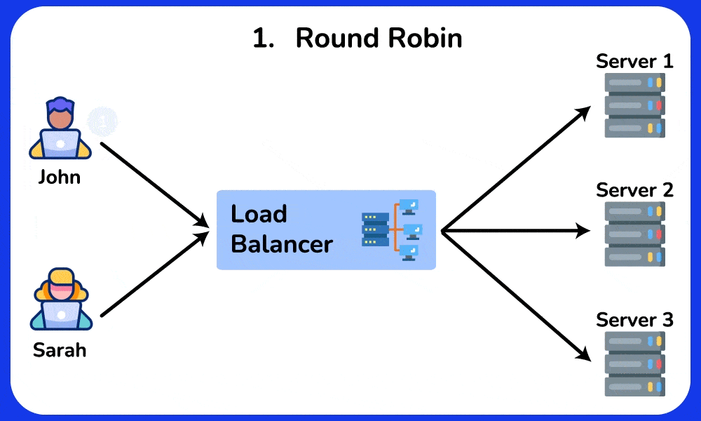

# Load Balancing Algorithms
**Load Balancing Algorithm**: Is used to distribute incoming network requests to a server, we mainly want to do this to optimize server performance as well as user experience. These algorithms can consider factors such as server capacity, active connections, response times, and server health to make a informed decision to distribute incoming requests. 
## 1. Round Robin
This algorithm distributes incoming requests to servers in a cyclic order. It assigns a request to the first server, then moves to the second, third, and so on, and after reaching the last server, it starts again at the first.
### Pros:
- 
