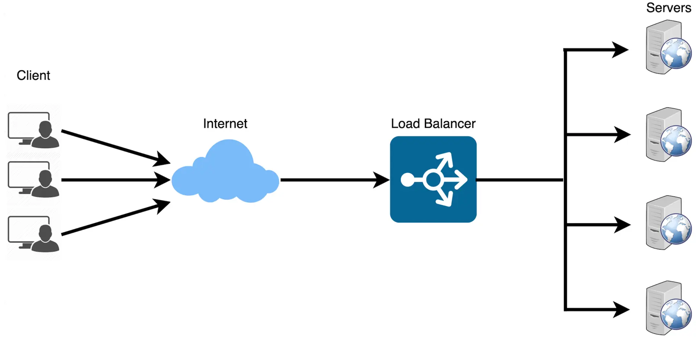
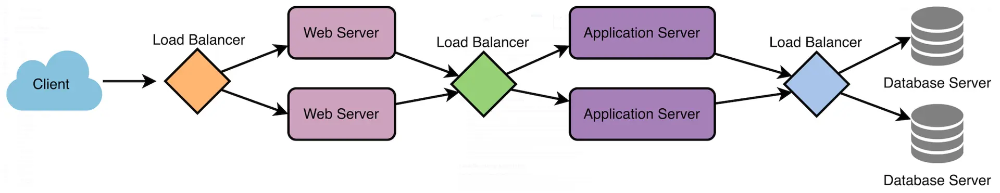

# Load Balancing Algorithms
## 1. What is Load Balancer
- **Load Balancer**: Extremely important part in system design, because it helps distribute incoming requests and traffic evenly across multiple servers. Overall the main goal of load balancing is to ensure high availability, reliability, and performance by avoiding overloading a single server and avoiding downtime.
- Typically a load balancer sits between the client and the server accepting incoming network and application traffic and distrubting the traffic across multiple backend servers using various algorithms, thus reducing the load on individual servers.
  
### To ensure full scalibility, we can try to balance the load at each layer of the system. By adding Load Balancers at three locations
- Between user and web server
- Between web server and an internal platform layer, like application servers or cache servers
- Between internal platform layer and database

## 2. Key Terminology
- **Load Balancer**: A device or software that distrubutes network traffic across multiple servers based on predefined rules or algorithms 
- **Backend Server**: Servers that recieve and process requests forwarded by the load balancer
- **Health Check**: Periodic tests performed by the load balancer to determine the avaiability and performance of backend servers. Unhealthy servers would be removed from the server pool until they recover