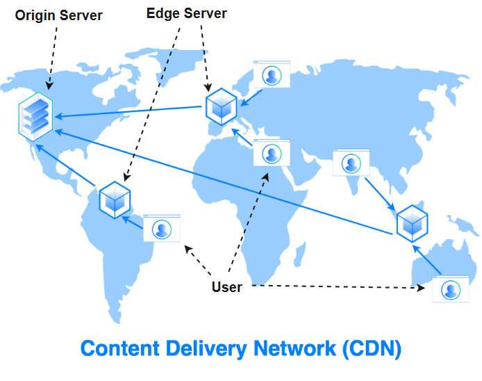

# What is CDN?

A **Content Delivery Network (CDN)** is a distributed network of servers strategically located across various geographical locations to deliver web content, such as images, videos, and other static assets, more efficiently to users. The primary purpose of a CDN is to reduce latency and improve the overall performance of web applications by serving content from the server nearest to the user. CDNs can also help improve the reliability, availability, and security of web applications.

---

## How CDNs Work

When a user requests content from a web application, the request is routed to the nearest CDN server (also known as an **edge server**) based on factors such as network latency and server load. The edge server then checks if the requested content is already cached. If it is, the content is served directly from the cache; otherwise, the edge server fetches the content from the **origin server**, caches it, and serves it to the user. Subsequent requests for the same content can then be served from the cache, reducing latency and offloading traffic from the origin server.

---

## Key Terminology and Concepts

1. **Point of Presence (PoP)**:
   - A PoP is a physical location where CDN servers are deployed, typically in data centers distributed across various geographical locations. PoPs are strategically placed close to end-users to minimize latency and improve content delivery performance.

2. **Edge Server**:
   - An edge server is a CDN server located at a PoP, responsible for caching and delivering content to end-users. These servers store cached copies of the content, reducing the need to fetch data from the origin server.

3. **Origin Server**:
   - The origin server is the primary server where the original content is stored. CDNs fetch content from the origin server and cache it on edge servers for faster delivery to end-users.

4. **Cache Warming**:
   - Cache warming is the process of preloading content into the edge server's cache before it is requested by users, ensuring that the content is available for fast delivery when it is needed.

5. **Time to Live (TTL)**:
   - TTL is a value that determines how long a piece of content should be stored in the cache before it is considered stale and needs to be refreshed from the origin server.

6. **Anycast**:
   - Anycast is a network routing technique used by CDNs to direct user requests to the nearest available edge server, based on the lowest latency or the shortest network path.

7. **Content Invalidation**:
   - Content invalidation is the process of removing or updating cached content when the original content on the origin server changes, ensuring that end-users receive the most up-to-date version of the content.

8. **Cache Purging**:
   - Cache purging is the process of forcibly removing content from the edge server's cache, usually triggered manually or automatically when specific conditions are met.

---

## Benefits of Using a CDN

CDNs play a crucial role in enhancing the performance, reliability, and security of modern web applications. By serving content from geographically distributed edge servers, CDNs can provide users with a fast and seamless experience, while reducing load on origin servers and protecting against security threats. Here are the top benefits of using CDNs:

1. **Reduced Latency**:
   - By serving content from geographically distributed edge servers, CDNs reduce the time it takes for content to travel from the server to the user, resulting in faster page load times and improved user experience.

2. **Improved Performance**:
   - CDNs can offload static content delivery from the origin server, freeing up resources for dynamic content generation and reducing server load. This can lead to improved overall performance for web applications.

3. **Enhanced Reliability and Availability**:
   - With multiple edge servers in different locations, CDNs can provide built-in redundancy and fault tolerance. If one server becomes unavailable, requests can be automatically rerouted to another server, ensuring continuous content delivery.

4. **Scalability**:
   - CDNs can handle sudden traffic spikes and large volumes of concurrent requests, making it easier to scale web applications to handle growing traffic demands.

5. **Security**:
   - Many CDNs offer additional security features, such as DDoS protection, Web Application Firewalls (WAF), and SSL/TLS termination at the edge, helping to safeguard web applications from various security threats.
