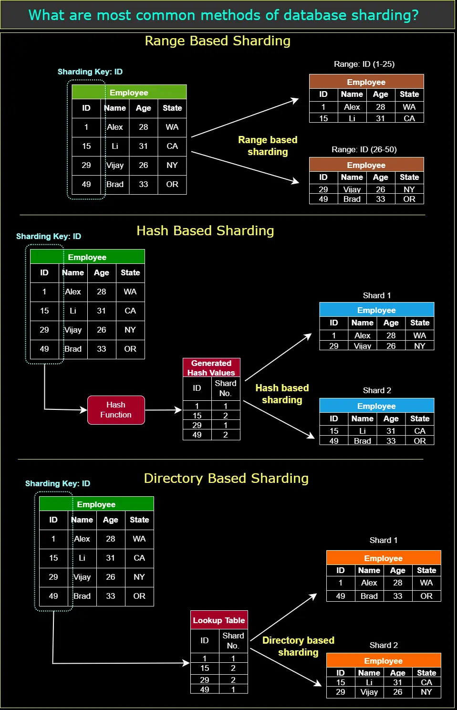
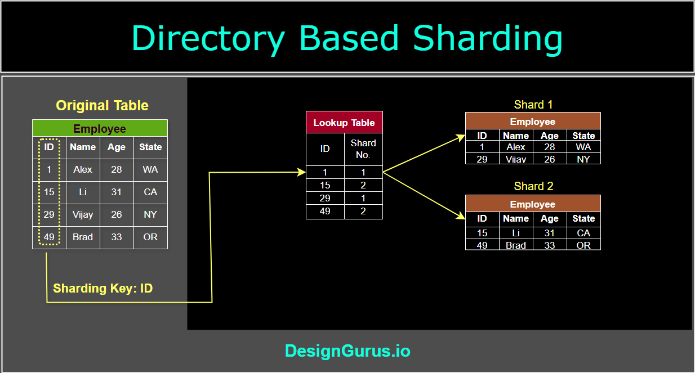
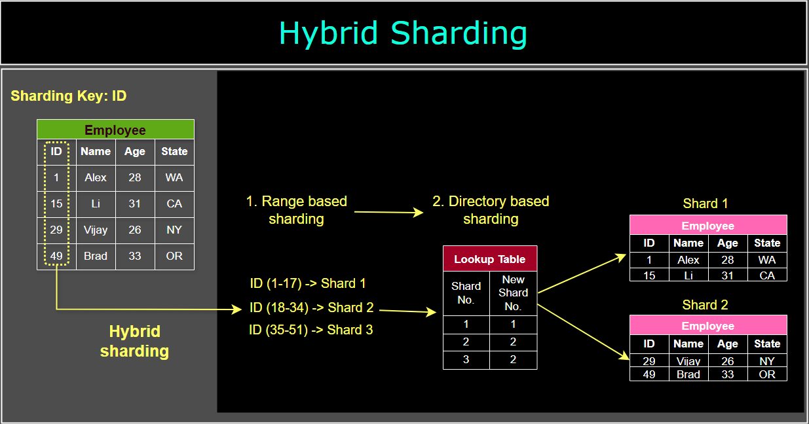

# Data Sharding Techniques

Data sharding, a type of horizontal partitioning, is a technique used to distribute large datasets across multiple storage resources, often referred to as shards. By dividing data into smaller, more manageable pieces, sharding can improve performance, scalability, and resource utilization. Below are several data sharding techniques with examples:

---

## 1. Range-based Sharding

In range-based sharding, data is divided into shards based on a specific range of values for a given partitioning key. Each shard is responsible for a specific range, ensuring that the data is distributed in a predictable manner.

**Example**: An e-commerce platform stores order data and decides to shard it based on order dates. Shards can be created for specific date ranges, such as monthly or yearly intervals. When a query targets a specific date range, only the relevant shard needs to be accessed, which improves query performance.

---

## 2. Hash-based Sharding

Hash-based sharding involves applying a consistent hash function to the partitioning key, which generates a hash value that determines the destination shard for each data entry. This method ensures an even distribution of data across shards and is particularly useful when the partitioning key has a large number of distinct values or is not easily divided into ranges.

**Example**: A social media platform stores user data and decides to shard it based on user IDs. The platform applies a hash function to the user ID, generating a hash value that determines the shard for each user’s data. This approach ensures an even distribution of data across shards, optimizing storage efficiency and query performance.

---

## 3. Directory-based Sharding

Directory-based sharding uses a lookup table, often referred to as a directory, to map each data entry to a specific shard. This method offers greater flexibility, as shards can be added, removed, or reorganized without the need to rehash or reorganize the entire dataset. However, it introduces an additional layer of complexity, as the directory must be maintained and kept consistent.

**Example**: An online gaming platform stores player data and decides to use directory-based sharding. The platform maintains a directory that maps each player’s username to a specific shard. When a query targets a specific player’s data, the system first consults the directory to determine the relevant shard, then retrieves the data from that shard.

---

## 4. Geographical Sharding

Geographical sharding involves partitioning data based on geographical locations, such as countries or regions. This method can help reduce latency and improve performance for users in specific locations by storing their data closer to them.

**Example**: A global streaming service stores user data and decides to shard it based on the user’s country. Each shard contains data for users from a specific country, and these shards are stored in data centers located within or near that country. This approach ensures that users can access their data with lower latency, improving the streaming experience.

---

## 5. Dynamic Sharding

Dynamic sharding is an adaptive approach that automatically adjusts the number of shards based on the data’s size and access patterns. This method can help optimize resource utilization and performance by creating shards as needed and merging or splitting them as the data grows or shrinks.

**Example**: An Internet of Things (IoT) platform collects sensor data from a large number of devices. The platform uses dynamic sharding to automatically adjust the number of shards based on the volume and frequency of incoming data. As more devices are added or removed, the platform can create or merge shards accordingly, ensuring optimal resource utilization and performance.

---

## 6. Hybrid Sharding: The Best of Many Worlds

Why stick to one method when you can combine a few and get the best results? Hybrid Sharding is a blend of multiple sharding strategies to optimize performance. It might combine Geo-based with Directory-based sharding, or any other mix that suits a system's needs.

**Its Strength**: By tailoring solutions and leveraging the strengths of different techniques, systems can achieve unprecedented efficiency levels.

**Snapshot**: Many cloud service providers, given their diverse clientele and global infrastructure, adopt hybrid sharding. It's their secret sauce to ensure consistent, high-speed services across the board.

