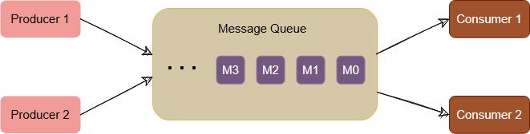
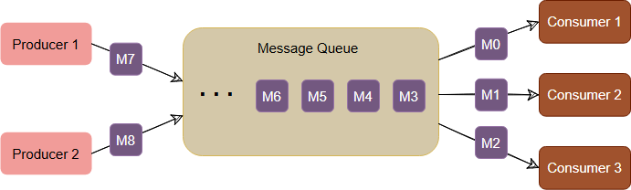
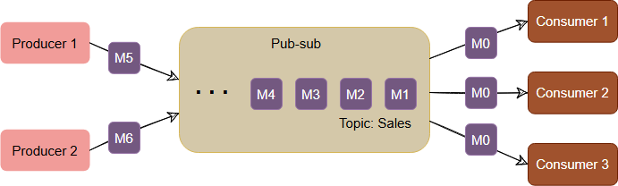
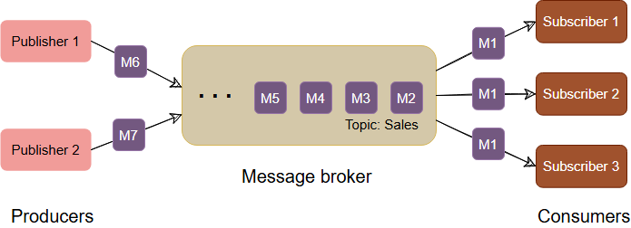

# Introduction to Messaging System

## Background

One of the common challenges among distributed systems is handling a continuous influx of data from multiple sources. For instance, imagine a log aggregation service receiving hundreds of log entries per second from different sources. The role of this service is to store the logs on disk at a shared server and also build an index so that the logs can be searched later. Some challenges that arise in such a scenario include:

- **Handling a spike of messages**: What happens if the service receives more messages per second than it can handle? How do we manage multiple instances of the service and divide the workload among them?
- **Receiving messages from different sources**: Different sources need to decide on a common protocol and data format for sending messages to the log aggregation service. This creates a strongly coupled architecture between producers and consumers.
- **Service downtime**: What happens to the log messages if the log aggregation service is down or unresponsive for a period of time?

To efficiently manage these scenarios, distributed systems depend upon a **messaging system**.

## What is a messaging system?

A **messaging system** is responsible for transferring data among services, applications, processes, or servers. It helps decouple different parts of a distributed system by providing an asynchronous way of transferring messages between the sender and receiver. This allows senders (producers) and receivers (consumers) to focus on the data/message, without worrying about the mechanisms used to share the data.

### Types of Messaging Systems

There are two common models for handling messages: **Queuing** and **Publish-Subscribe**.

### Queue

In the **queuing model**, messages are stored sequentially in a queue. Producers push messages to the rear of the queue, and consumers extract messages from the front. 

- A particular message can only be consumed by a maximum of one consumer. Once a consumer grabs a message, it is removed from the queue, and the next consumer will get the next message.
- This model is useful for distributing message processing among multiple consumers but has the limitation that multiple consumers cannot read the same message.

#### Message Consumption in a Message Queue

- **Producer** → Sends messages to the rear of the queue.
- **Consumer** → Extracts messages from the front of the queue.

### Publish-Subscribe Messaging System

In the **Publish-Subscribe (pub-sub)** model, messages are categorized into **topics**. 

- A **publisher** sends messages to a topic, and these messages get stored under that topic.
- **Subscribers** subscribe to a topic to receive every message published to that topic.
- Unlike the queuing model, the pub-sub model allows multiple consumers to receive the same message. If two consumers subscribe to the same topic, they will both receive the same messages.

### Message Broker

The **message broker** is the component that stores and manages the messages. It maintains loose coupling between publishers and subscribers or producers and consumers of data. The broker stores messages in a queue, which subscribers read from. This means that subscribers and publishers do not need to be synchronized, which allows for flexible processing rates.

#### Benefits of a Messaging System

- **Fault tolerance**: Messaging systems store messages to ensure that they are not lost even if the system fails temporarily.
- **Scalability**: These systems can handle large volumes of messages and scale horizontally to accommodate increased workloads.
- **Asynchronous Communication**: Messaging systems enable components to process messages at their own pace, which is particularly useful in high-latency environments.
  
### Why Use a Messaging System?

A messaging system is deployed in an application stack for the following reasons:

- **Messaging Buffering**: Provides a mechanism for buffering incoming messages to handle temporary spikes in workload.
- **Guaranteed Message Delivery**: Producers can publish messages with the assurance that they will eventually be delivered, even if the consuming application is unavailable when the message is published.
- **Providing Abstraction**: Decouples the sender and receiver components, promoting modularity and ease of system maintenance.
- **Scalability**: Distributed messaging systems scale horizontally to accommodate growing workloads without performance degradation.
- **Fault Tolerance**: Redundancy in the system ensures that the message is not lost even if a single node fails.
- **Load Balancing**: Automatically distributes messages across multiple nodes to avoid bottlenecks and optimize performance.
- **Message Persistence**: Ensures that messages are not lost if a receiver is temporarily unavailable or slow.
- **Security**: Many messaging systems offer encryption and authentication to protect data.
- **Interoperability**: Messaging systems support multiple protocols and can integrate with various platforms and technologies, making it easier to connect different components in a system.

In summary, a messaging system enables efficient communication between services in a distributed system, providing features such as fault tolerance, scalability, asynchronous communication, and message persistence.
