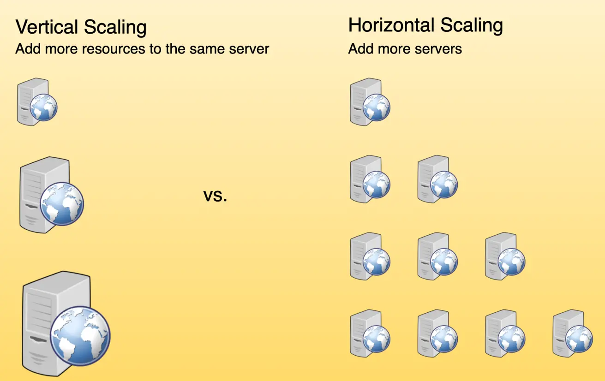

# Scalability

Scalability refers to a system's ability to handle an increasing workload by either adding resources (**scaling out**) or upgrading the capacity of existing resources (**scaling up**). It is a crucial feature in distributed systems to effectively manage growing demands of users, data, and processing power. Below is an overview of the different aspects of scalability:

---

## A. Horizontal Scaling

- **Definition**: Also known as scaling out, horizontal scaling involves adding more machines or nodes to a system to distribute the workload evenly.
- **Advantages**:
  - Cost-effective for managing fluctuating workloads.
  - Maintains high availability by reducing the risk of overloading individual nodes.
  - Ideal for distributed systems where tasks can be split among multiple nodes.
- **Examples**:
  - **Cassandra** and **MongoDB** are excellent examples as they allow for seamless horizontal scaling by adding more machines to meet growing demands.

---

## B. Vertical Scaling

- **Definition**: Also known as scaling up, vertical scaling increases the capacity of individual nodes by upgrading hardware components such as CPU, memory, or storage.
- **Advantages**:
  - Improves performance by allowing nodes to handle larger workloads.
  - Requires fewer changes to the system architecture compared to horizontal scaling.
- **Limitations**:
  - Physical limits to the amount of resources a single machine can handle.
  - Can lead to single points of failure if a node fails.
  - Scaling up often involves downtime during the upgrade process.
- **Example**:
  - **MySQL** supports vertical scaling by migrating workloads to machines with higher capacities, though it often involves downtime.

---

## Horizontal Scaling vs. Vertical Scaling

| Feature                  | Horizontal Scaling                     | Vertical Scaling                      |
|--------------------------|-----------------------------------------|---------------------------------------|
| **Definition**           | Adding more machines or nodes          | Increasing capacity of individual nodes |
| **Ease of Scaling**      | Easier to scale dynamically            | Limited by physical resource capacity |
| **Availability**         | High availability due to node redundancy | Single point of failure risk          |
| **Downtime**             | Minimal to no downtime                 | Often involves downtime               |
| **Examples**             | Cassandra, MongoDB                     | MySQL                                 |

---

## Visual Comparison

---

Scalability strategies should be chosen based on the system's requirements, workload characteristics, and cost considerations. While horizontal scaling is better for distributed systems with dynamic and high availability needs, vertical scaling can be a simpler solution for smaller systems with predictable workloads.
