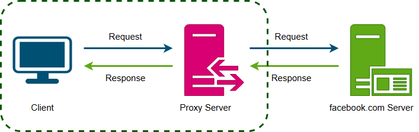
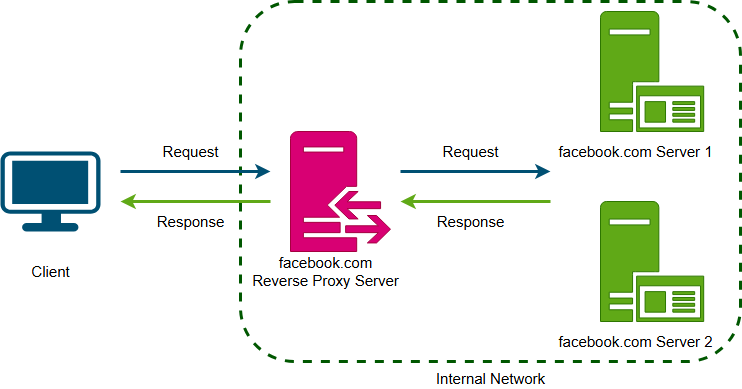
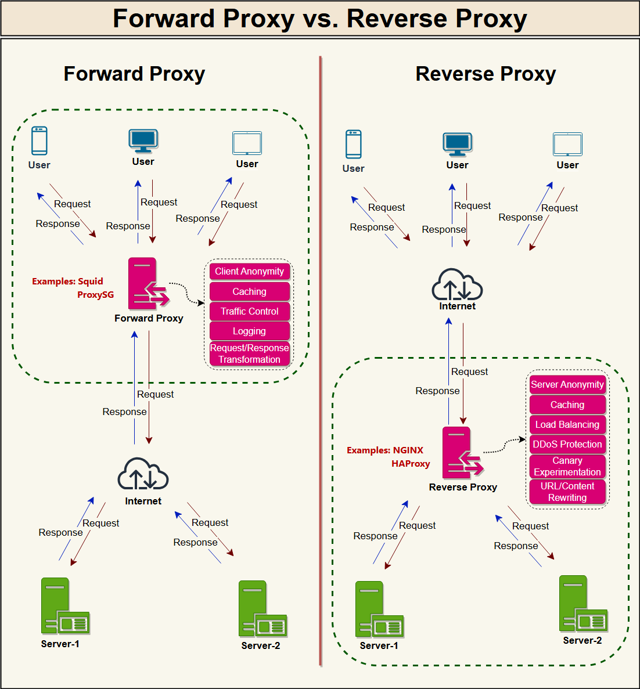

# What is a Proxy Server?

A forward proxy, also known as a "proxy server," or simply "proxy," is a server that sits in front of one or more client machines and acts as an intermediary between the clients and the internet. When a client machine makes a request to a resource (like a web page or file) on the internet, the request is first sent to the forward proxy. The forward proxy then forwards the request to the internet on behalf of the client machine and returns the response to the client machine.

Typically, forward proxies are used to cache data, filter requests, log requests, or transform requests (by adding/removing headers, encrypting/decrypting, or compressing a resource).

A forward proxy can hide the identity of the client from the server by sending requests on behalf of the client.

In addition to coordinating requests from multiple servers, proxies can also optimize request traffic from a system-wide perspective. Proxies can combine the same data access requests into one request and then return the result to the user; this technique is called collapsed forwarding. Consider a request for the same data across several nodes, but the data is not in cache. By routing these requests through the proxy, they can be consolidated into one so that we will only read data from the disk once.

---

## Reverse Proxy

A reverse proxy is a server that sits in front of one or more web servers and acts as an intermediary between the web servers and the Internet. When a client makes a request to a resource on the internet, the request is first sent to the reverse proxy. The reverse proxy then forwards the request to one of the web servers, which returns the response to the reverse proxy. The reverse proxy then returns the response to the client.

Contrary to the forward proxy, which hides the client's identity, a reverse proxy hides the server's identity.

In the above diagram, the reverse proxy hides the final server that served the request from the client. The client makes a request for some content from facebook.com; this request is served by Facebook’s reverse proxy server, which gets the response from one of the backend servers and returns it to the client.

A reverse proxy, just like a forward proxy, can be used for caching, load balancing, or routing requests to the appropriate servers.

---

## Forward Proxy vs. Reverse Proxy

### Summary

A proxy is a piece of software or hardware that sits between a client and a server to facilitate traffic. A forward proxy hides the identity of the client, whereas a reverse proxy conceals the identity of the server. So, when you want to protect your clients on your internal network, you should put them behind a forward proxy; on the other hand, when you want to protect your servers, you should put them behind a reverse proxy.
