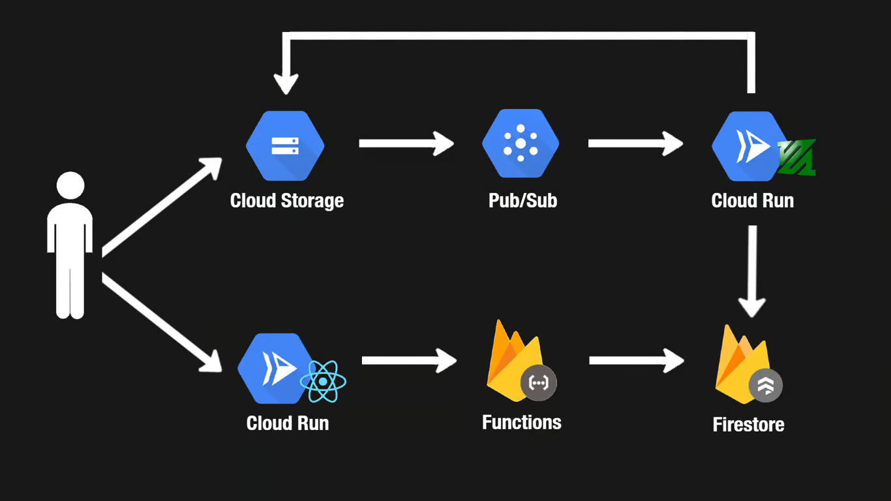

# YouTube Skeleton Clone Design

## Introduction
This document outlines the design of a simplified YouTube clone, implemented as part of my Full Stack Development course.

The objective of this project is not to create an exact replica of YouTube but to develop a skeleton where the core functionalities of YouTube are implemented. The focus is on simplicity and learning, while addressing some scalability trade-offs, rather than building a production-ready system.

---

## Background
YouTube is a video-sharing platform enabling users to upload, view, rate, share, and comment on videos.  

Due to its massive scale (1B+ daily active users), even "trivial" features like commenting involve significant complexity. This project primarily focuses on **video uploading** and **viewing videos**, keeping the scope manageable.

---

## Requirements
- **Authentication:** Users can sign in/out using their Google account.
- **Video Upload:** Signed-in users can upload videos.
- **Video Formats:** Videos are transcoded to multiple formats (e.g., 360p, 720p).
- **Video Viewing:** 
  - Any user (signed in or not) can view a list of uploaded videos.  
  - Any user (signed in or not) can view individual videos.

---

## High-Level Design
### Architecture Diagram

### Key Components
#### 1. **Video Storage (Cloud Storage)**
- **Purpose:** Host raw and processed videos.
- **Reason:** Simple, scalable, and cost-effective for large file storage and retrieval.

#### 2. **Video Upload Events (Cloud Pub/Sub)**
- **Purpose:** Add a durability layer for video upload events and enable asynchronous processing.
- **Workflow:** Publish a message to a Pub/Sub topic when a video is uploaded.

#### 3. **Video Processing Workers (Cloud Run)**
- **Purpose:** Transcode videos using `ffmpeg`, an open-source tool widely used in the industry.
- **Scalability:** Leverages Cloud Run's ability to scale up/down to handle inconsistent workloads.

#### 4. **Video Metadata (Firestore)**
- **Purpose:** Store metadata (e.g., title, description) for processed videos to display in the web client.

#### 5. **Video API (Firebase Functions)**
- **Purpose:** Provide a simple API for video uploads and metadata retrieval. Can support CRUD operations in the future.

#### 6. **Web Client (Next.js / Cloud Run)**
- **Purpose:** A Next.js-based web client for users to sign in and upload videos.  
- **Hosting:** Deployed on Cloud Run.

#### 7. **Authentication (Firebase Auth)**
- **Purpose:** Handle user authentication and integrate with Google Sign-In.

---

## Detailed Design

### 1. **User Sign Up**
- **Workflow:**
  - Users sign up using their Google account, handled by Firebase Auth.
  - A unique user ID and email address are stored.
  - Additional info (e.g., name, profile picture) is stored in a Firestore `users` collection.

- **Server-Side Trigger:**
  - Firebase Functions handle user document creation to avoid client-side errors like browser crashes or network issues.

---

### 2. **Video Upload**
- **Authentication:** Only signed-in users can upload videos.
- **Storage:**  
  - Use Google Cloud Storage for large video files.
  - Generate signed URLs via Firebase Functions for secure client-side uploads.
- **Workflow:**  
  - Users specify the video to upload.
  - A signed URL (based on the video file extension) is generated.
  - Users upload directly to the raw video bucket in Cloud Storage.

---

### 3. **Video Processing**
- **Message Queue:** Cloud Pub/Sub enables decoupled and scalable video processing.  
  - Upload events publish a message to a Pub/Sub topic.  
  - Messages are pushed to video processing workers for transcoding.
  
- **Transcoding:** Videos are transcoded using `ffmpeg` and uploaded to a public Cloud Storage bucket. Metadata is stored in Firestore.

- **Limitations:**
  - Cloud Run has a max timeout of 3600 seconds.
  - Pub/Sub redelivers messages after 600 seconds if unacknowledged.
  - Illegal content within videos is not checked.

---

## Limitations & Future Work
Please refer to the limitations section for a detailed list of challenges and potential enhancements.

---

## References
- [Firebase Auth](https://firebase.google.com/docs/auth)  
- [Cloud Storage Signed URLs](https://cloud.google.com/storage/docs/access-control/signed-urls)  
- [Pub/Sub Push Subscriptions](https://cloud.google.com/pubsub/docs/push)  
- [Using Pub/Sub with Cloud Storage](https://cloud.google.com/storage/docs/pubsub-notifications)  
- [Using Pub/Sub with Cloud Run](https://cloud.google.com/run/docs/tutorials/pubsub)
